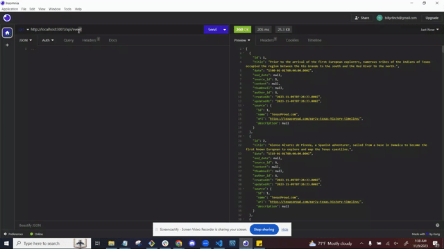

# Project2-TexasTimeline
Github Repository:
 https://github.com/aalemanyz67/Project2-TexasTimeline 
Heroku Deployed Link:
  
Github Collaborator Repositories:
 Fernando Valle:https://github.com/elmfer 
 Jessica Linex:https://github.com/jlinex 
 Billy Finch:https://github.com/bfinch3 
 Albert Aleman:https://github.com/aalemanyz67 

# Objective:
Within our group, are task was to create an interactive full-stack  application. Our goal is to demonstrate the skills that we have learned and show how well as a team we can work to create a full-stack application. Our goal is to work effectively and efficiently to create our application.
# Description:
Texas is a fascinating state, home to many interesting historical events. Through our application the user will see an interactive timeline in which historical events will be displayed. The user will be able to click on an event and receive descriptions,videos, maps, and images of what occurred on that date.
# Installation:
In order for our application to work, you will need Vscode, Mysql Workbench, git terminal, and a Heroku account at the minimal.
Within Vscode you will initiate the application by typing npm i within your terminal. Ensure that all packages have been downloaded.
Next, in the terminal command node seeds/index.js to seed data into mysql database. Upon seeding data, user will be prompted with a question about clearing data that was previously saved. User can select yes or no and continue with seeding the data. Once data has been seeded, the user can go to you browser and input in the web address bar. In order to view the timeline, you will beed to create an account. Finally you will be able to view the timeline.

## Seeding the Database

You can seed the database with initial data using the `seed` module.

To run it, run `npm run seed` in the project's directory. Initial seed data comes from the seeds.json file.

It also asks you if you want to delete the database if it is not empty prior to seeding it to restart it.

# Usage and Future Improvements
This application is a wonderful educational tool that can be used accross various platforms. Timeline.js is not only for historical information, but can be used to view an array of different topics.
 ## Improvements
 Our group feels that our application can be further developed by further creating a community aspect to it. In the future we would like to create comment sections so that other users can interact with the information they are viewing or learning about. We would alos like to create a discussion board in which discuss can be carried out over vairous topics. We felt that we could further imporve our application by expanding the database accross different genres such as books, movies, music, mental health, automotive and so on. 

 # Screenshots
 Inital collaboration and design of our web application.
   

 Diagram of the database.
  

 Texas Timeline sign up/login demo
 

 
 # Collaborators and Resources
 Github Collaborator Repositories:
 Fernando Valle:https://github.com/elmfer (Helped with Backend) 
 Jessica Linex:https://github.com/jlinex (Helped with Frontend) 
 Billy Finch:https://github.com/bfinch3 (Helped with Backend) 
 Albert Aleman:https://github.com/aalemanyz67 (Helped with Frontend) 

# Resources
 Mozilla Documentation for api methods and paths https://developer.mozilla.org/en-US/docs/Web/API 
 npm express package: https://www.npmjs.com/package/express 
 npm mysql2 package: https://www.npmjs.com/package/mysql2 
 npm dotenv package: https://www.npmjs.com/package/dotenv 
 Timeline.js https://timeline.knightlab.com/ 
 npm bcrypt https://www.npmjs.com/package/bcrypt 
 npm connect-session-sequelize https://www.npmjs.com/package/connect-sequelize 
 npm express-handlebars https://www.npmjs.com/package/express-handlebars 
 npm espress-sessions https://www.npmjs.com/package/express-session  
 npm sequelize https://www.npmjs.com/package/sequelize  

# License:MIT
https://choosealicense.com/licenses/mit/

